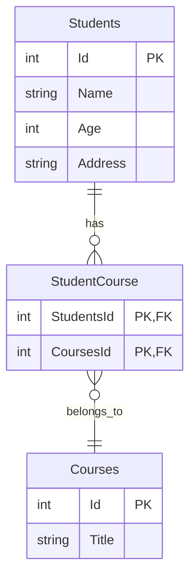

# Many-to-Many Relationships in Entity Framework Core

## Overview
Many-to-Many relationships in Entity Framework Core occur when one entity can have multiple instances of another entity and vice versa. For example, a student can take multiple courses, and a course can have multiple students.

## Database Structure
A many-to-many relationship requires three tables in the database:
1. First entity table (e.g., Students)
2. Second entity table (e.g., Courses)
3. Junction table (e.g., StudentCourse)



## Code Implementation

### Basic Entity Classes
```csharp
internal class Student
{
    public int Id { get; set; }
    public string Name { get; set; }
    public int? Age { get; set; }
    public string Address { get; set; }
    
    // Navigational Property => Many
    public ICollection<Course> Courses { get; set; } = new HashSet<Course>();
}

internal class Course
{
    public int Id { get; set; }
    public string Title { get; set; }
    
    // Navigational Property => Many
    public ICollection<Student> Students { get; set; } = new HashSet<Student>();
}
```

## Junction Table Considerations

### Scenario 1: Simple Junction Table
When the junction table only contains foreign keys (no additional attributes), you don't need to:
- Create a class for it
- Define it as a DbSet
- Use any data annotations

EF Core will:
1. Automatically detect the many-to-many relationship from the navigation properties
2. Create the junction table during migration
3. Handle the relationship mapping internally

### Scenario 2: Junction Table with Additional Properties
If the junction table needs to store additional information (e.g., enrollment date, grade), you should:
1. Create a class representing the junction table
2. Add it as a DbSet in your context
3. Configure the relationships explicitly

Example with additional properties:
```csharp
public class StudentCourse
{
    public int StudentId { get; set; }
    public int CourseId { get; set; }
    public DateTime EnrollmentDate { get; set; }
    public string Grade { get; set; }
    
    public Student Student { get; set; }
    public Course Course { get; set; }
}
```

## Key Points
1. Navigation properties must be defined in both entities
2. Use `ICollection<T>` or similar interfaces for navigation properties
3. Initialize collections to avoid null reference exceptions
4. The junction table name will be generated as a combination of the entity table names
5. Composite key in the junction table consists of both foreign keys

## Migration Behavior
When you add a migration, EF Core will:
1. Create tables for both main entities
2. Detect the many-to-many relationship
3. Automatically create the junction table
4. Set up appropriate foreign key constraints
5. Configure the composite primary key in the junction table

## Best Practices
1. Use `HashSet<T>` for navigation properties to prevent duplicate entries
2. Consider making navigation properties virtual for lazy loading
3. Use appropriate cascade delete behaviors
4. Consider indexing foreign key columns in the junction table
5. Use meaningful names for junction table if creating custom ones
