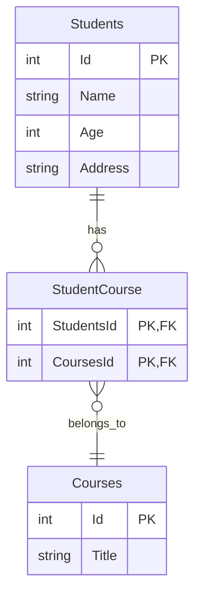
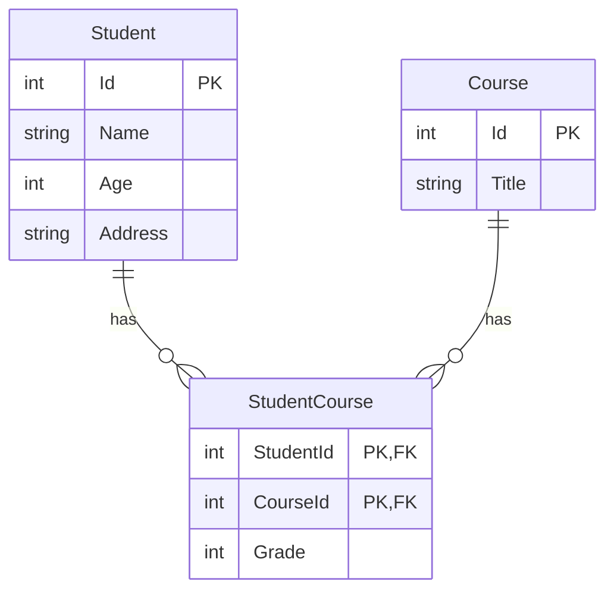
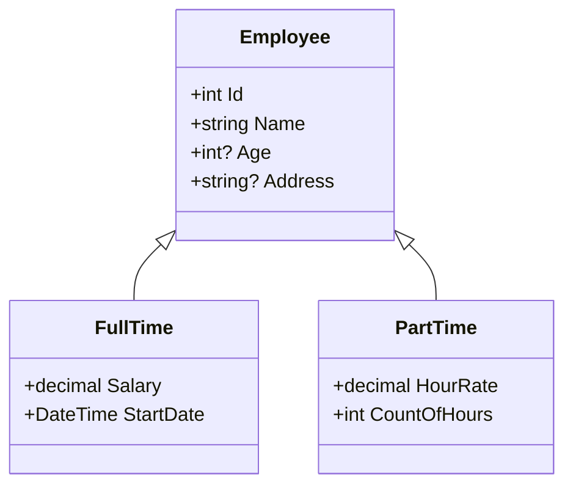

# Many-to-Many Relationships in Entity Framework Core

## Overview
Many-to-Many relationships in Entity Framework Core occur when one entity can have multiple instances of another entity and vice versa. For example, a student can take multiple courses, and a course can have multiple students.

## Database Structure
A many-to-many relationship requires three tables in the database:
1. First entity table (e.g., Students)
2. Second entity table (e.g., Courses)
3. Junction table (e.g., StudentCourse)



## Code Implementation

### Basic Entity Classes
```csharp
internal class Student
{
    public int Id { get; set; }
    public string Name { get; set; }
    public int? Age { get; set; }
    public string Address { get; set; }
    
    // Navigational Property => Many
    public ICollection<Course> Courses { get; set; } = new HashSet<Course>();
}

internal class Course
{
    public int Id { get; set; }
    public string Title { get; set; }
    
    // Navigational Property => Many
    public ICollection<Student> Students { get; set; } = new HashSet<Student>();
}
```

## Junction Table Considerations

### Scenario 1: Simple Junction Table
When the junction table only contains foreign keys (no additional attributes), you don't need to:
- Create a class for it
- Define it as a DbSet
- Use any data annotations

EF Core will:
1. Automatically detect the many-to-many relationship from the navigation properties
2. Create the junction table during migration
3. Handle the relationship mapping internally

### Scenario 2: Junction Table with Additional Properties
If the junction table needs to store additional information (e.g., enrollment date, grade), you should:
1. Create a class representing the junction table
2. Add it as a DbSet in your context
3. Configure the relationships explicitly

Example with additional properties:
```csharp
public class StudentCourse
{
    public int StudentId { get; set; }
    public int CourseId { get; set; }
    public DateTime EnrollmentDate { get; set; }
    public string Grade { get; set; }
    
    public Student Student { get; set; }
    public Course Course { get; set; }
}
```

## Key Points
1. Navigation properties must be defined in both entities
2. Use `ICollection<T>` or similar interfaces for navigation properties
3. Initialize collections to avoid null reference exceptions
4. The junction table name will be generated as a combination of the entity table names
5. Composite key in the junction table consists of both foreign keys

## Migration Behavior
When you add a migration, EF Core will:
1. Create tables for both main entities
2. Detect the many-to-many relationship
3. Automatically create the junction table
4. Set up appropriate foreign key constraints
5. Configure the composite primary key in the junction table

## Best Practices
1. Use `HashSet<T>` for navigation properties to prevent duplicate entries
2. Consider making navigation properties virtual for lazy loading
3. Use appropriate cascade delete behaviors
4. Consider indexing foreign key columns in the junction table
5. Use meaningful names for junction table if creating custom ones


# Configuring Many-to-Many Relationships with Join Entity in EF Core

## Understanding the Join Entity Pattern

### Why Use a Join Entity?
A join entity (also known as a junction class) is necessary when:
1. You need to configure the relationship explicitly
2. You have additional attributes on the relationship (e.g., Grade)
3. You need more control over the relationship's behavior

### Incorrect Approach
```csharp
// Don't configure direct many-to-many relationship when using join entity
modelBuilder.Entity<Student>()
    .HasMany(s => s.Courses)
    .WithMany(c => c.Students);

// OR
modelBuilder.Entity<Course>()
    .HasMany(c => c.Students)
    .WithMany(s => s.Courses);
```

### Correct Implementation

#### 1. Join Entity Class
```csharp
internal class StudentCourse
{
    public int StudentId { get; set; }
    public int CourseId { get; set; }
    public int Grade { get; set; }

    // Navigational Property => ONE
    public Student Student { get; set; }
    public Course Course { get; set; }
}
```

#### 2. Student Entity
```csharp
internal class Student
{
    public int Id { get; set; }
    public string Name { get; set; }
    public int? Age { get; set; }
    public string Address { get; set; }

    // Navigational Property => Many
    public ICollection<StudentCourse> StudentCourses { get; set; } 
        = new HashSet<StudentCourse>();
}
```

#### 3. Course Entity
```csharp
internal class Course
{
    public int Id { get; set; }
    public string Title { get; set; }

    // Navigational Property => Many
    public ICollection<StudentCourse> CourseStudents { get; set; } 
        = new HashSet<StudentCourse>();
}
```

## Key Concepts

### Relationship Structure
- No direct relationship between Student and Course
- Student ←→ StudentCourse: One-to-Many
- Course ←→ StudentCourse: One-to-Many
- The combination creates the Many-to-Many relationship

### Navigation Properties
1. In Join Entity:
   - Single references to both entities (ONE)
   - `Student` and `Course` properties

2. In Main Entities:
   - Collection of join entities (MANY)
   - `StudentCourses` in Student
   - `CourseStudents` in Course

### Convention-Based Configuration
- EF Core will automatically configure the relationships when:
  - Foreign keys follow naming conventions (EntityNameId)
  - Navigation properties are properly set up
  - No additional configuration is needed

## Database Schema



## Best Practices
1. Use meaningful names for navigation properties
2. Initialize collections to prevent null reference exceptions
3. Consider using HashSet<T> for better performance
4. Follow naming conventions for foreign keys
5. Add appropriate indexes on foreign key columns
6. Consider adding validation attributes for additional properties
7. Document the purpose of additional attributes in the join entity


# Configuring Many-to-Many Relationships with Fluent API in EF Core

## Fluent API Configuration Steps

### 1. Configure Join Entity Primary Key
```csharp
modelBuilder.Entity<StudentCourse>()
    .HasKey(sc => new { sc.StudentId, sc.CourseId }); // Composite Primary Key
```

### 2. Configure Student-StudentCourse Relationship
```csharp
// Full configuration
modelBuilder.Entity<Student>()
    .HasMany(s => s.StudentCourses)
    .WithOne(sc => sc.Student);

// Simplified version (when navigation property naming follows convention)
modelBuilder.Entity<Student>()
    .HasMany(s => s.StudentCourses)
    .WithOne();
```

### 3. Configure Course-StudentCourse Relationship
```csharp
// Full configuration
modelBuilder.Entity<Course>()
    .HasMany(c => c.CourseStudents)
    .WithOne(sc => sc.Course);

// Simplified version
modelBuilder.Entity<Course>()
    .HasMany(c => c.CourseStudents)
    .WithOne();
```

## Database Schema


## Additional Configuration Options

### Relationship Requirements
```csharp
modelBuilder.Entity<Student>()
    .HasMany(s => s.StudentCourses)
    .WithOne(sc => sc.Student)
    .IsRequired(); // Make the relationship required

modelBuilder.Entity<Course>()
    .HasMany(c => c.CourseStudents)
    .WithOne(sc => sc.Course)
    .IsRequired(false); // Make the relationship optional
```

### Foreign Key Configuration
```csharp
modelBuilder.Entity<Student>()
    .HasMany(s => s.StudentCourses)
    .WithOne(sc => sc.Student)
    .HasForeignKey(sc => sc.StudentId);
```

## Implementation Steps

1. Create entity classes
2. Configure composite key
3. Set up relationships using Fluent API
4. Add migration:
   ```bash
   add-migration AddStudentCourseRelationship
   ```
5. Update database:
   ```bash
   update-database
   ```

## Key Points
1. Composite primary key must be configured using Fluent API
2. Both sides of the relationship should be configured
3. Navigation properties can be configured explicitly or by convention
4. Additional relationship configurations (IsRequired, DeleteBehavior, etc.) can be chained
5. Migration will create appropriate indexes for foreign keys

## Best Practices
1. Configure composite keys before relationships
2. Use meaningful names for navigation properties
3. Consider adding appropriate indexes

4. Document relationship requirements
5. Test cascade delete behaviors
6. Validate data integrity constraints
7. Consider adding appropriate foreign key constraints

# Inheritance Mapping in Entity Framework Core: Table Per Concrete Class (TPC)

## Overview
Table Per Concrete Class (TPCC) is an inheritance mapping strategy where each concrete class in the inheritance hierarchy gets its own database table containing all properties (inherited and specific).

## Class Hierarchy



## Database Schema (TPCC)
Each concrete class gets its own table with all properties:

### FullTimeEmployee Table
| Column     | Type      | Description           |
|------------|-----------|----------------------|
| ID         | int       | Primary Key          |
| Name       | string    | From base class      |
| Age        | int?      | From base class      |
| Address    | string?   | From base class      |
| Salary     | decimal   | Specific to FullTime |
| StartDate  | DateTime  | Specific to FullTime |

### PartTimeEmployee Table
| Column        | Type    | Description           |
|--------------|---------|----------------------|
| ID           | int     | Primary Key          |
| Name         | string  | From base class      |
| Age          | int?    | From base class      |
| Address      | string? | From base class      |
| HourRate     | decimal | Specific to PartTime |
| CountOfHours | int     | Specific to PartTime |

## Implementation

### 1. Base Class (Employee)
```csharp
internal abstract class Employee
{
    public int Id { get; set; }
    public string Name { get; set; }
    public int? Age { get; set; }
    public string? Address { get; set; }
}
```

### 2. Concrete Classes
```csharp
internal class FullTime : Employee
{
    public decimal Salary { get; set; }
    public DateTime StartDate { get; set; }
}

internal class PartTime : Employee
{
    public decimal HourRate { get; set; }
    public int CountOfHours { get; set; }
}
```

### 3. DbContext Configuration
```csharp
public class CompanyDbContext : DbContext
{
    // Only concrete classes need DbSet properties
    public DbSet<FullTime> FullTimeEmployees { get; set; }
    public DbSet<PartTime> PartTimeEmployees { get; set; }

    protected override void OnConfiguring(DbContextOptionsBuilder optionsBuilder)
    {
        optionsBuilder.UseSqlServer(
            "Server=.;Database=Route;Trusted_Connection=True;"
        );
    }
}
```

## Key Points

1. **Abstract Base Class**:
   - Not required by EF Core
   - Recommended for business logic
   - Prevents instantiation of base class

2. **Database Tables**:
   - One table per concrete class
   - Each table contains all properties (inherited + specific)
   - No table for abstract base class

3. **DbSet Requirements**:
   - Only concrete classes need DbSet properties
   - Base class doesn't need DbSet

4. **Required NuGet Packages**:
   ```xml
   <PackageReference Include="Microsoft.EntityFrameworkCore.SqlServer" />
   <PackageReference Include="Microsoft.EntityFrameworkCore.Tools" />
   ```

## Benefits of TPCC
1. Clean table structure
2. No nullable columns for subclass-specific properties
3. Easy to understand and maintain
4. Efficient querying of concrete types

## Considerations
1. Duplicate columns across tables
2. More complex queries when querying base type
3. Schema changes to base class require updating all tables

## Best Practices
1. Make base class abstract when business logic requires it
2. Use meaningful names for DbSet properties
3. Consider using a naming convention for tables
4. Document inheritance strategy in code
5. Consider performance implications for polymorphic queries
